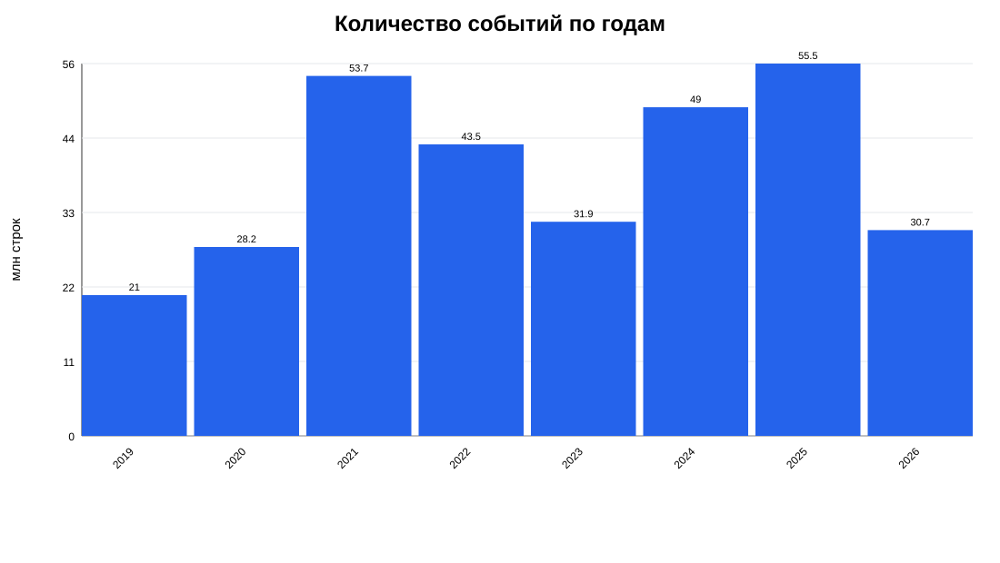
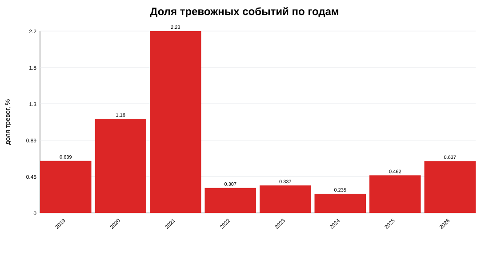
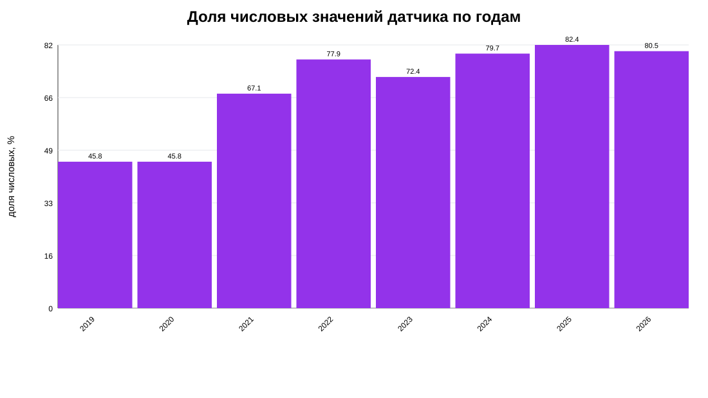
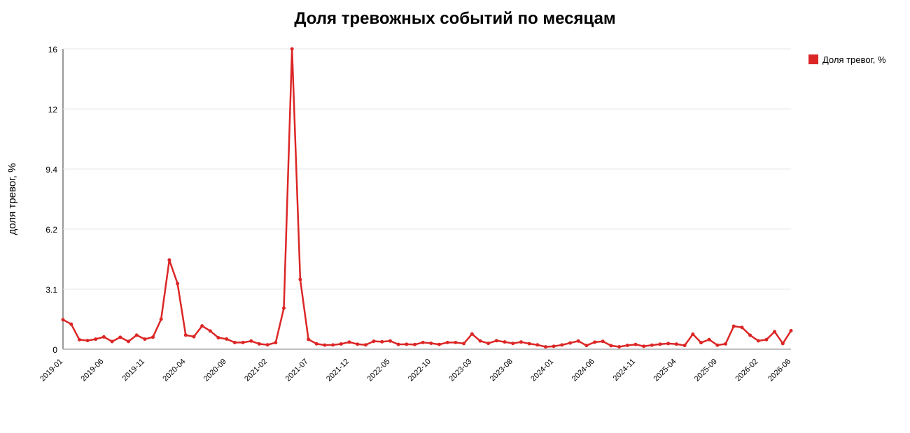
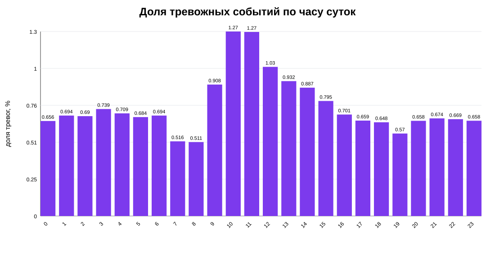
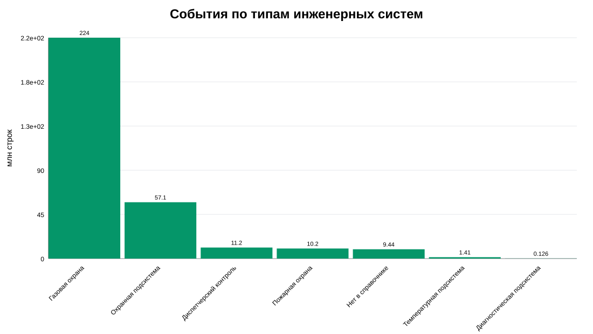
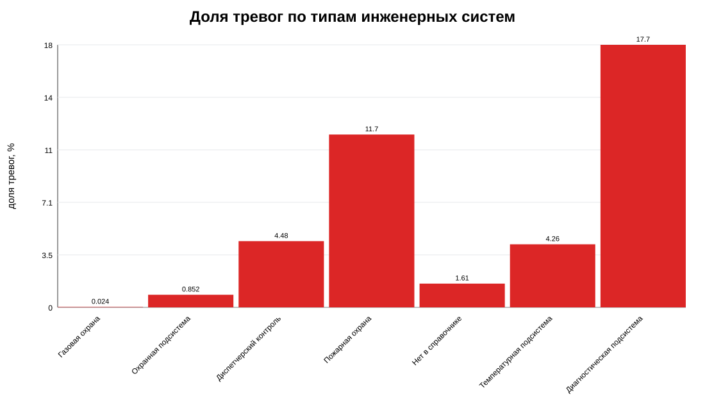
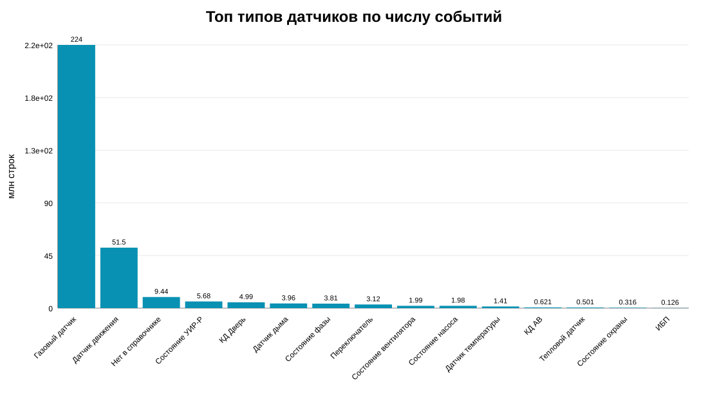
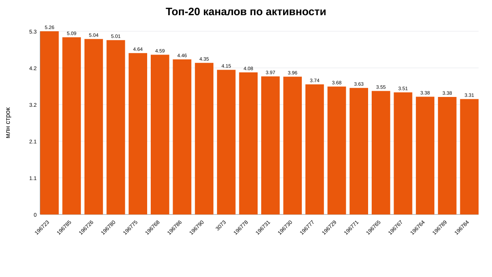

# EDA исходных данных ЛЦТ: инженерные коллекторы

## Краткое резюме

Полный потоковый анализ годовых журналов охватил 313,546,017 строк за 2019-2026 годы. Тревожных событий найдено 2,467,812, общая доля тревог составляет 0.7871%. Это означает сильный дисбаланс классов: даже простая постановка target по полю `тревожное` будет требовать аккуратной валидации, подбора порогов и метрик Precision/Recall.

Самый объемный год по числу событий - 2025 (55,541,797 строк). Самая высокая доля тревог по годам - 2021 (2.2340%). Это важно сверить с Q&A по кейсу: 2021 год мог быть нетипичным из-за внедрения новой версии системы мониторинга.

Главный вывод по target: поле `тревожное` можно использовать как базовый прокси-target для тревожного события, но оно не является однозначной разметкой отказа датчика, аварии или подтвержденного инцидента. В данных нет полной связки с решением диспетчера, ложностью/истинностью тревоги и журналом ОДС.

## Файлы и объемы

| файл | размер_mb | строк_с_заголовком |
| --- | --- | --- |
| ext-journal-2019.7z | 134.912 | 20993329 |
| ext-journal-2020.7z | 168.293 | 28172399 |
| ext-journal-2021.7z | 271.129 | 53698949 |
| ext-journal-2022.7z | 227.665 | 43483150 |
| ext-journal-2023.7z | 177.282 | 31937126 |
| ext-journal-2024.7z | 252.125 | 49023884 |
| ext-journal-2025.7z | 277.214 | 55541798 |
| ext-journal-2026.7z | 157.646 | 30695390 |

## Сводка по годам

| год | строк | тревог | доля_тревог_% | уникальных_каналов | первая_дата | последняя_дата | числовых_значений | текстовых_значений |
| --- | --- | --- | --- | --- | --- | --- | --- | --- |
| 2019 | 20993328 | 134199 | 0.639246 | 5622 | 2019-01-01 | 2019-12-31 | 9624289 | 11369039 |
| 2020 | 28172398 | 325662 | 1.15596 | 7250 | 2020-01-01 | 2020-12-31 | 12914371 | 15258027 |
| 2021 | 53698948 | 1199639 | 2.23401 | 8625 | 2021-01-01 | 2021-12-31 | 36057607 | 17641341 |
| 2022 | 43483149 | 133504 | 0.307025 | 10722 | 2022-01-01 | 2022-12-31 | 33853235 | 9629914 |
| 2023 | 31937125 | 107712 | 0.337263 | 10400 | 2023-01-01 | 2023-12-31 | 23114518 | 8822607 |
| 2024 | 49023883 | 115203 | 0.234994 | 10348 | 2024-01-01 | 2024-12-31 | 39061884 | 9961999 |
| 2025 | 55541797 | 256471 | 0.461762 | 11484 | 2025-01-01 | 2025-12-31 | 45767599 | 9774198 |
| 2026 | 30695389 | 195422 | 0.636649 | 11447 | 2026-01-01 | 2026-06-30 | 24695254 | 6000135 |

## Покрытие справочников

| проверка | значение |
| --- | --- |
| Каналы из журналов, всего | 12628 |
| Каналы в справочнике, всего | 11485 |
| Каналы журнала без справочника | 1143 |
| Каналы справочника без событий | 0 |
| Объекты из событий через каналы | 78 |
| Объекты в справочнике | 95 |
| Объекты событий без справочника | 0 |
| Объекты справочника без событий | 17 |

Связка каналов с объектами в локальном справочнике присутствует через `ид_объект`. Если канал есть в журнале, но отсутствует в справочнике, для него нельзя напрямую получить тип датчика, тип инженерной системы и объект. Такие случаи нужно обрабатывать отдельной категорией.

## Качество данных

| проверка | значение | комментарий |
| --- | --- | --- |
| Всего строк в годовых журналах | 313546017 | Без строки заголовка |
| Всего тревог | 2467812 | По полю тревожное |
| Общая доля тревог, % | 0.787065 | Сильный дисбаланс классов |
| Каналы без справочника | 1143 | Влияет на построение признаков по типу датчика и объекту |
| Объекты без справочника | 0 | Проверка связки канал -> объект |
| 2021 год | 2.23401 | Год нужно проверять отдельно из-за внедрения новой версии мониторинга |
| Target | неоднозначен | Поле тревожное есть, но нет подтверждения ОДС/ложности/истинности инцидента |

Проверка дублей по всем архивам выполнена масштабируемо: точная проверка первых 1 млн строк каждого года и приблизительная оценка уникальности `ид_события` через HyperLogLog по всем строкам. Полная точная проверка всех ID потребовала бы хранить сотни миллионов идентификаторов или выполнять тяжелую внешнюю сортировку.

| год | строк | примерная_уникальность_event_id | примерная_оценка_дублей_event_id | точные_дубли_event_id_в_первых_1млн |
| --- | --- | --- | --- | --- |
| 2019 | 20993328 | 21095767 | 0 | 0 |
| 2020 | 28172398 | 28149758 | 22640 | 0 |
| 2021 | 53698948 | 52703611 | 995337 | 0 |
| 2022 | 43483149 | 42467680 | 1015469 | 0 |
| 2023 | 31937125 | 31258296 | 678829 | 0 |
| 2024 | 49023883 | 49318221 | 0 | 0 |
| 2025 | 55541797 | 56558059 | 0 | 0 |
| 2026 | 30695389 | 30685052 | 10337 | 0 |

## Значения датчиков

В поле `значение_датчика` смешаны числовые показания и текстовые состояния. Это принципиально важно: температурные и газовые датчики можно анализировать как числовые ряды, а бинарные/дискретные каналы нужно анализировать через события, состояния и паттерны переключений.

| год | числовые | текстовые | пустые | доля_числовых_% | доля_текстовых_% |
| --- | --- | --- | --- | --- | --- |
| 2019 | 9624289 | 11369039 | 0 | 45.8445 | 54.1555 |
| 2020 | 12914371 | 15258027 | 0 | 45.8405 | 54.1595 |
| 2021 | 36057607 | 17641341 | 0 | 67.1477 | 32.8523 |
| 2022 | 33853235 | 9629914 | 0 | 77.8537 | 22.1463 |
| 2023 | 23114518 | 8822607 | 0 | 72.3751 | 27.6249 |
| 2024 | 39061884 | 9961999 | 0 | 79.6793 | 20.3207 |
| 2025 | 45767599 | 9774198 | 0 | 82.4021 | 17.5979 |
| 2026 | 24695254 | 6000135 | 0 | 80.4527 | 19.5473 |

Топ текстовых значений:

| значение | строк |
| --- | --- |
| Движения нет | 28353973 |
| Обнаружено движение | 28353871 |
| Норма | 11914514 |
| Неопределен | 7503339 |
| Не замкнут | 2783109 |
| Выключен | 2319843 |
| Включен | 2101510 |
| Неисправен | 1500298 |
| Обесточен | 1288383 |
| Есть питание | 1105757 |
| Дыма нет | 173609 |
| Обнаружен дым | 172066 |
| Разговор | 108109 |
| Вызов | 93577 |
| Работают все насосы в АНС | 92229 |
| На охране | 83399 |
| Снято с охраны | 83386 |
| Затоплен | 64437 |
| Рычаг норма | 42103 |
| Рычаг сдернут | 42093 |

## Временные паттерны

## Инженерные системы и типы датчиков

| тип_инж_системы | строк | доля_строк_% | тревог | доля_тревог_% |
| --- | --- | --- | --- | --- |
| Газовая охрана | 224012118 | 71.4447 | 53849 | 0.0240384 |
| Охранная подсистема | 57149278 | 18.2268 | 487023 | 0.852194 |
| Диспетчерский контроль | 11216108 | 3.57718 | 501979 | 4.47552 |
| Пожарная охрана | 10193256 | 3.25096 | 1190783 | 11.6821 |
| Нет в справочнике | 9439855 | 3.01068 | 151740 | 1.60744 |
| Температурная подсистема | 1409472 | 0.449526 | 60087 | 4.26309 |
| Диагностическая подсистема | 125930 | 0.0401632 | 22351 | 17.7487 |

Топ типов датчиков по числу событий:

| тип_датчика | строк | доля_строк_% | тревог | доля_тревог_% |
| --- | --- | --- | --- | --- |
| Газовый датчик | 224012118 | 71.4447 | 53849 | 0.0240384 |
| Датчик движения | 51473736 | 16.4166 | 204944 | 0.398153 |
| Нет в справочнике | 9439855 | 3.01068 | 151740 | 1.60744 |
| Состояние УИР-Р | 5684500 | 1.81297 | 6079 | 0.10694 |
| КД Дверь | 4986555 | 1.59037 | 37515 | 0.752323 |
| Датчик дыма | 3961622 | 1.26349 | 1170658 | 29.55 |
| Состояние фазы | 3805421 | 1.21367 | 25985 | 0.682842 |
| Переключатель | 3118061 | 0.994451 | 477 | 0.015298 |
| Состояние вентилятора | 1987797 | 0.633973 | 145702 | 7.32982 |
| Состояние насоса | 1976744 | 0.630448 | 317979 | 16.086 |
| Датчик температуры | 1409472 | 0.449526 | 60087 | 4.26309 |
| КД АВ | 620739 | 0.197974 | 231019 | 37.2168 |
| Тепловой датчик | 501064 | 0.159806 | 2278 | 0.454633 |
| Состояние охраны | 315661 | 0.100675 | 8097 | 2.56509 |
| ИБП | 125930 | 0.0401632 | 22351 | 17.7487 |
| Ручной извещатель | 46070 | 0.0146932 | 11768 | 25.5437 |
| КД Люк | 36059 | 0.0115004 | 3839 | 10.6464 |
| Стекло | 31687 | 0.010106 | 9619 | 30.3563 |
| Датчик затопления | 12424 | 0.00396242 | 3739 | 30.095 |
| 9-секционный люк | 502 | 0.000160104 | 87 | 17.3307 |

## Активность каналов

События распределены по каналам неравномерно: есть каналы с очень высокой активностью. Это может быть как нормальная особенность телеметрии, так и признак каналов, которые будут доминировать в обучении модели, если не делать нормализацию или агрегацию по временным окнам.

| ид_канала_данных | тип_инж_системы | тип_датчика | ид_объект | строк | тревог | доля_тревог_% |
| --- | --- | --- | --- | --- | --- | --- |
| 196723 | Газовая охрана | Газовый датчик | 5122 | 5262505 | 7535 | 0.143183 |
| 196785 | Газовая охрана | Газовый датчик | 5122 | 5090188 | 11987 | 0.235492 |
| 196726 | Газовая охрана | Газовый датчик | 5122 | 5040101 | 66 | 0.0013095 |
| 196780 | Газовая охрана | Газовый датчик | 5122 | 5008439 | 34 | 0.000678854 |
| 196775 | Газовая охрана | Газовый датчик | 5122 | 4635899 | 6411 | 0.13829 |
| 196768 | Газовая охрана | Газовый датчик | 5122 | 4588072 | 15 | 0.000326935 |
| 196786 | Газовая охрана | Газовый датчик | 5122 | 4455502 | 15 | 0.000336662 |
| 196790 | Газовая охрана | Газовый датчик | 5122 | 4354606 | 94 | 0.00215863 |
| 3073 | Охранная подсистема | Датчик движения | 99 | 4154958 | 350 | 0.00842367 |
| 196778 | Газовая охрана | Газовый датчик | 5122 | 4081585 | 18 | 0.000441005 |
| 196731 | Газовая охрана | Газовый датчик | 5122 | 3965947 | 50 | 0.00126073 |
| 196730 | Газовая охрана | Газовый датчик | 5122 | 3958400 | 414 | 0.0104588 |
| 196777 | Газовая охрана | Газовый датчик | 5122 | 3738030 | 108 | 0.00288922 |
| 196729 | Газовая охрана | Газовый датчик | 5122 | 3675305 | 21 | 0.000571381 |
| 196771 | Газовая охрана | Газовый датчик | 5122 | 3634776 | 15 | 0.00041268 |
| 196765 | Газовая охрана | Газовый датчик | 5122 | 3548141 | 13 | 0.000366389 |
| 196767 | Газовая охрана | Газовый датчик | 5122 | 3508490 | 78 | 0.00222318 |
| 196764 | Газовая охрана | Газовый датчик | 5122 | 3382068 | 35 | 0.00103487 |
| 196789 | Газовая охрана | Газовый датчик | 5122 | 3375673 | 18 | 0.000533227 |
| 196784 | Газовая охрана | Газовый датчик | 5122 | 3314837 | 18 | 0.000543013 |

Каналы с высокой долей тревог среди каналов с минимум 1000 событий:

| ид_канала_данных | тип_инж_системы | тип_датчика | ид_объект | строк | тревог | доля_тревог_% |
| --- | --- | --- | --- | --- | --- | --- |
| 115801 | Диспетчерский контроль | Состояние насоса | 3902 | 4181 | 2144 | 51.2796 |
| 115800 | Диспетчерский контроль | Состояние насоса | 3902 | 4119 | 2085 | 50.6191 |
| 330460 | Охранная подсистема | КД АВ | 5961 | 77968 | 38972 | 49.9846 |
| 334692 | Пожарная охрана | Датчик дыма | 5962 | 51172 | 25545 | 49.9199 |
| 228541 | Охранная подсистема | Датчик движения | 5343 | 92886 | 46248 | 49.7901 |
| 330579 | Охранная подсистема | Датчик движения | 5961 | 5740 | 2851 | 49.669 |
| 50894 | Нет в справочнике | Нет в справочнике | Нет в справочнике | 23846 | 11829 | 49.6058 |
| 334602 | Пожарная охрана | Датчик дыма | 5962 | 15682 | 7777 | 49.5919 |
| 330437 | Охранная подсистема | КД АВ | 5961 | 1692 | 835 | 49.3499 |
| 50835 | Нет в справочнике | Нет в справочнике | Нет в справочнике | 12734 | 6275 | 49.2775 |
| 2991 | Нет в справочнике | Нет в справочнике | Нет в справочнике | 7464 | 3675 | 49.2363 |
| 228571 | Температурная подсистема | Датчик температуры | 5343 | 81407 | 40078 | 49.2316 |
| 50866 | Нет в справочнике | Нет в справочнике | Нет в справочнике | 14502 | 7134 | 49.1932 |
| 286887 | Охранная подсистема | КД АВ | 5676 | 1756 | 861 | 49.0319 |
| 3051 | Охранная подсистема | КД АВ | 28 | 9482 | 4640 | 48.9348 |
| 115807 | Диспетчерский контроль | Состояние насоса | 3902 | 6587 | 3220 | 48.8842 |
| 144862 | Охранная подсистема | КД АВ | 4391 | 9676 | 4729 | 48.8735 |
| 3053 | Охранная подсистема | КД АВ | 28 | 8192 | 4003 | 48.8647 |
| 334189 | Пожарная охрана | Ручной извещатель | 5962 | 1572 | 768 | 48.855 |
| 115813 | Диспетчерский контроль | Состояние насоса | 3902 | 3032 | 1479 | 48.7797 |

## Корреляции с прокси-target

Корреляции посчитаны на уровне каналов: target - доля тревожных событий канала, признаки - агрегаты активности и значений канала. Это не заменяет будущую временную ML-валидацию, но помогает увидеть первичные связи.

| feature | target | pearson |
| --- | --- | --- |
| активных_дней | доля_тревог_% | -0.168252 |
| доля_числовых_% | доля_тревог_% | -0.146627 |
| событий_в_день | доля_тревог_% | -0.0582089 |
| строк | доля_тревог_% | -0.0565568 |
| числовых_значений | доля_тревог_% | -0.049209 |
| текстовых_значений | доля_тревог_% | -0.0303564 |
| максимум_значения | доля_тревог_% | -0.0287538 |
| std_значения | доля_тревог_% | -0.0273368 |
| среднее_значение | доля_тревог_% | -0.0267416 |
| отрицательных_чисел | доля_тревог_% | -0.0226027 |
| минимум_значения | доля_тревог_% | 0.0169596 |
| sentinel_значений | доля_тревог_% | 0.00544451 |
| пустых_значений | доля_тревог_% |  |

Самая заметная первичная связь с долей тревог: `активных_дней` с Pearson -0.168252. Интерпретацию нужно делать осторожно: корреляция на уровне каналов не означает причинность и может отражать тип датчика или режим записи данных.

## Однозначность target

Target не определяется однозначно. Поле `тревожное` говорит о тревожном событии в мониторинге, но не говорит, было ли это подтвержденной аварией, отказом датчика, ложным срабатыванием или действием человека. Из Q&A известно, что журнал ОДС и helpdesk не имеют прямой полной связки с каждым событием датчика. Поэтому для MVP разумно рассматривать несколько постановок:

1. `alarm_event` - текущее событие является тревожным по полю `тревожное`.
2. `alarm_next_24h` - по каналу или объекту появится тревога в следующие 24 часа.
3. `alarm_burst_next_24h` - появится серия тревог или аномально высокая частота событий.
4. `sensor_anomaly` - значение или паттерн канала выглядит нетипично относительно истории.

Для хакатона наиболее безопасный первый target - прогноз тревожного события или тревожного кластера на горизонте 24 часа. При этом в документации обязательно нужно написать, что это прокси-target, а не подтвержденная авария.

## Нетривиальные особенности данных

- Датасет очень большой: более 313,546,017 строк, поэтому EDA и feature engineering должны быть потоковыми или батчевыми.
- Значения датчиков смешивают числа и текстовые состояния; единая обработка `значение_датчика` как float невозможна.
- 2021 год требует отдельной проверки как потенциально аномальный период внедрения новой системы мониторинга.
- Активность каналов сильно неравномерна: часть каналов генерирует непропорционально много событий.
- Target по полю `тревожное` есть, но бизнес-target отказа/аварии не размечен однозначно.

## Сохраненные таблицы

- `tables/file_inventory.csv`
- `tables/year_summary.csv`
- `tables/missing_by_file.csv`
- `tables/duplicate_estimates.csv`
- `tables/dictionary_coverage.csv`
- `tables/month_summary.csv`
- `tables/hour_summary.csv`
- `tables/weekday_summary.csv`
- `tables/engineering_system_summary.csv`
- `tables/sensor_type_summary.csv`
- `tables/object_summary.csv`
- `tables/channel_top_activity.csv`
- `tables/channel_top_alarm_rate.csv`
- `tables/value_kind_by_year.csv`
- `tables/top_text_values.csv`
- `tables/target_correlation_channel_features.csv`
- `tables/feature_correlation_matrix.csv`
- `tables/data_quality_checks.csv`
