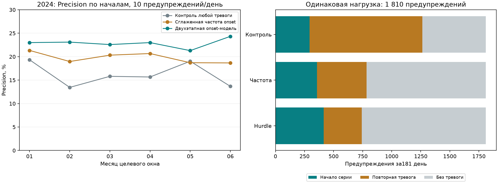

# Проверка переноса onset-метода: 2023 → 2024

На 181 днях и 74 объектах двухэтапный метод охватил **414 начал против 293** у сопоставимого контроля: +121, или +41.3% при одинаковых 1810 предупреждениях (10 в день). Сглаженная историческая частота даёт 358 попаданий; преимущество над этим более сильным для onset ориентиром — +56, или +15.6%.

Семейство, параметры и бюджет заданы до оценки 2024; по этому году ничего не перенастраивалось. Но семейство уже было выбрано по более поздним данным, а справочник текущий. Проверка является ретроспективной проверкой переноса, **не новым слепым испытанием** и не доказательством прогноза физических поломок.

## Одинаковая цель и нагрузка

| Метод | AP onset | Precision@10 | Recall onset | Начала | Повторные тревоги | Без тревоги |
|---|---:|---:|---:|---:|---:|---:|
| Контроль любой тревоги | 0.1763 | 16.19% | 16.99% | 293 | 970 | 547 |
| Сглаженная частота onset | 0.1865 | 19.78% | 20.75% | 358 | 425 | 1027 |
| Двухэтапная onset-модель | 0.2740 | 22.87% | 24.00% | 414 | 329 | 1067 |

Всего 1725 зарегистрированных начал на 13394 объект-днях. Прирост Precision@10 против контроля: +6.69 п.п.; парный недельный 95% интервал [4.78; 8.60] п.п. 1000 повторов, seed84. Интервал описывает вариацию этого периода, не устраняя выбор семейства по поздним данным и зависимости между неделями.

Декабрьский gate пройден: 68 против 49 начал при 290 предупреждениях. Предварительно заданный критерий переноса: выполнен. Рабочие веса и политика интерфейса не заменялись.

## Цена изменения цели и наблюдаемость

Предупреждений на дни без любой тревоги стало 1067 вместо 547. Precision по любой тревоге снизилась с 69.78% до 41.05%. Поэтому метод не объявляется универсально лучшим и не заменяет прежнюю цель.

Из чистого прироста 121 попаданий 93 приходится на дни после полного отсутствия любых записей в промежуточный D+1: 135 против 42. При наличии записей выигрыш равен 28. Возможное объяснение части прироста — возобновление регистрации. Будущая наблюдаемость использована только для последующего анализа; она не фильтрует выдачу.

Против исторической частоты картина иная: на днях после отсутствия записей hurdle даёт 135 против 160 попаданий, а при наличии записей — 279 против 198. Следовательно, преимущество над частотой нельзя приписать только возобновлению регистрации.

## Результаты по месяцам

| Месяц целевого окна | Контроль: попадания | Частота: попадания | Hurdle: попадания | Предупреждения каждого |
|---|---:|---:|---:|---:|
| 2024-01 | 58 | 64 | 69 | 300 |
| 2024-02 | 39 | 55 | 67 | 290 |
| 2024-03 | 49 | 63 | 70 | 310 |
| 2024-04 | 47 | 62 | 69 | 300 |
| 2024-05 | 59 | 58 | 66 | 310 |
| 2024-06 | 41 | 56 | 73 | 300 |

Чувствительность к заранее заданным бюджетам 5/20 сохранена в [evaluation_metrics.csv](evaluation_metrics.csv); по ней метод не выбирался.



## Протокол и данные

Популяция — 74 объекта, имевших записи до 28.09.2023; поздняя активность не используется для отбора. Начало истории 01.01.2023. Train до признаков28.09 (исходы30.09), ранняя остановка на01.10–28.11 (исходы30.11), refit до28.11. Число деревьев hurdle: [126, 62], контроля: [112]. Декабрь не участвует в настройке. Оценка: признаки31.12.2023–28.06.2024; выдачи01.01–29.06; цели02.01–30.06. Високосный календарь даёт181 день.

Все 71 исходный признак и метки переносимого builder точно совпали со старой реализацией на 28 470 объект-днях2025. После усечения истории на15.03.2024 все прошлые признаки и scores трёх методов совпали точно; удаление всех outcome-столбцов не меняет прогноз.

**Сверка исходных архивов:** завершена для обоих лет.
- 2023: 31,937,125 исходных строк → 545,656 channel-days; все ключи и 11 входных счётчиков совпали точно. [Свидетельство](raw2023_count_check.json).
- 2024: 49,023,883 исходных строк → 505,007 channel-days; все ключи и 11 входных счётчиков совпали точно. [Свидетельство](raw2024_count_check.json).

Старый манифест указывал несохранённую в Git версию агрегатора. Независимая сверка проверяет содержание 11 используемых счётчиков, но не восстанавливает утраченный исходник и не проверяет неиспользуемые числовые агрегаты. Кэши и архивы не переписывались. Нынешнее соответствие каналов объектам, число каналов и родительские группы остаются не point-in-time. Дата события в архиве не подтверждает фактическое время поступления записи диспетчеру.

Воспроизведение в отдельной копии до существования выходных файлов:

```sh
.venv/bin/python src/modeling/object_onset_backtest.py fit
.venv/bin/python src/modeling/object_onset_backtest.py evaluate
.venv/bin/python scripts/verify_historical_counts.py 2023
.venv/bin/python scripts/verify_historical_counts.py 2024
.venv/bin/python scripts/summarize_onset_backtest.py
```

Повторный fit не перезаписывает существующие веса/конфигурацию. Обучение читает только2023; оценка проверяет зафиксированные SHA. Для новой копии нужны предоставленные архивы, справочники, дневные кэши и зависимости; веса и построчные прогнозы исключены из Git.

Источники: [протокол](protocol.md), [конфигурация](configuration.json), [проверки](checks.json), [интервалы](uncertainty.json), [наблюдаемость](observability.csv), [точное совпадение builder](history_parity.json).
