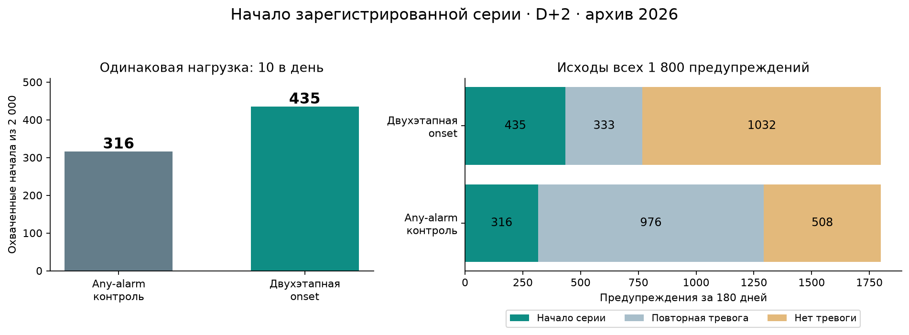

# Двухэтапный прогноз начала зарегистрированной серии

При одинаковых **1 800 предупреждениях** за 180 дней выбранная модель охватила **435 начал** против **316** у сопоставимого any-alarm контроля: **+119 (37,66% относительно контроля)**. Precision@10 вырос с 17,56% до 24,17%; полнота начал — с 15,80% до 21,75%. Сравниваются одна и та же onset-цель, 14 040 объект-дней и 2 000 зарегистрированных начал.

**Граница вывода:** период 2026 уже исследовался. Результат — сравнительная диагностика на прежних данных, не новая слепая проверка и не доказанное предупреждение физических отказов. Рабочая модель интерфейса не заменена.



## Постановка и выбор

Признаки заканчиваются на D; историческая выдача D+1 в 00:00, окно D+2. Положительная метка: на D+1 нет тревожных записей, на D+2 есть. Отсутствие записей не означает исправность. Все 78 объектов и дни сохранены.

Проверены восемь кандидатов: прямой LightGBM, условная двухэтапная модель и четыре совместных состояния будущих двух дней (по две фиксированные конфигурации), регуляризованная логистическая модель, сглаженная частота начал. Дополнительно проверены три заранее заданные смеси лучшего древесного и статистического вариантов. Выбор — только по октябрю–ноябрю 2025, Precision@10, затем AP.

Выбран hurdle_15: P(нет тревоги D+1 | история до D) × P(тревога D+2 | нет тревоги D+1, история до D). Условие второго компонента применяется только к обучающим строкам. При прогнозировании оба компонента используют доступную историю, не фактический D+1. По 188 и 187 деревьев, листья 15; веса повторно обучены до признаков 28.11.2025. Логистическая модель и смеси уступили по заранее заданному критерию.

Отдельный декабрьский контроль: 67 начал против 49 при 290 предупреждениях, Precision 23,10% против 16,90%. Настройки после декабря не изменялись.

## Результаты при одинаковой нагрузке

| Предупреждений в день | Модель | AP по onset | Precision | Полнота начал | Начал охвачено |
|---:|---|---:|---:|---:|---:|
| 5 | Any-alarm контроль | 0.1957 | 14,00% | 6,30% | 126 |
| 5 | Логистическая onset | 0.2250 | 22,67% | 10,20% | 204 |
| 5 | Двухэтапная onset | 0.2406 | 24,56% | 11,05% | 221 |
| 10 | Any-alarm контроль | 0.1957 | 17,56% | 15,80% | 316 |
| 10 | Логистическая onset | 0.2250 | 23,17% | 20,85% | 417 |
| 10 | Двухэтапная onset | 0.2406 | 24,17% | 21,75% | 435 |
| 20 | Any-alarm контроль | 0.1957 | 19,86% | 35,75% | 715 |
| 20 | Логистическая onset | 0.2250 | 21,64% | 38,95% | 779 |
| 20 | Двухэтапная onset | 0.2406 | 22,36% | 40,25% | 805 |

Основной бюджет 10 зафиксирован до расчёта; 5 и 20 — чувствительность. Парный недельный bootstrap, 1 000 повторов, 27 недель (2 неполные сохранены): разница Precision@10 **+6.61 п.п.**, 95% интервал **[5.22;8.14] п.п.**. Декабрьский и заранее заданный исследовательский gate пройдены. Bootstrap не устраняет зависимость между неделями, сдвиг данных или повторное использование 2026.

## Цена изменения цели

| Модель | Начало серии | Повторная тревога | Нет тревоги в целевом дне | Всего |
|---|---:|---:|---:|---:|
| Any-alarm контроль | 316 | 976 | 508 | 1800 |
| Двухэтапная onset | 435 | 333 | 1032 | 1800 |

Новая модель лучше ранжирует начала, но чаще выбирает дни вообще без тревоги: 1 032 вместо 508. Поэтому нельзя заявлять уменьшение ложных предупреждений по прежней any-alarm цели. Предупреждения на повторную тревогу полезны для отдельной задачи продолжающейся проблемы. Разные очереди требуют разных целей; новая модель не является универсальной заменой прежней.

## Наблюдаемость

| Записи на D+1 | Начал всего | Контроль: охвачено | Новая модель: охвачено |
|---|---:|---:|---:|
| Нет записей | 726 | 35 | 110 |
| Есть хотя бы одна запись | 1274 | 281 | 325 |

75 из 119 дополнительных начал относятся к дню после отсутствия любых записей. Они могут описывать возобновление регистрации, а не новое физическое событие. В страте с записями охват также вырос: 325 против 281. Страты заданы только для последующего анализа; будущая наблюдаемость не использовалась в выдаче. Наличие записей само по себе не доказывает полное покрытие датчиков.

## По месяцам, бюджет 10

| Целевой месяц | Контроль: начал | Новая модель: начал | Предупреждений |
|---|---:|---:|---:|
| 2026-01 | 60 | 77 | 300 |
| 2026-02 | 49 | 59 | 280 |
| 2026-03 | 49 | 73 | 310 |
| 2026-04 | 47 | 72 | 300 |
| 2026-05 | 52 | 74 | 310 |
| 2026-06 | 59 | 80 | 300 |

## Проверки и воспроизведение

Сохранённые модели загружены заново для оценки. Расчёт с укороченной историей до 15 марта и без будущих меток воспроизводит более ранние оценки: отклонение 0 у двухэтапной модели и до 1,7e−16 у логистической. Последние 78 оценок воспроизводятся точно без записей 29–30 июня и без целевых столбцов. Исходы 2000 начал совпадают с предыдущим аудитом. Контрольные веса, входы, исходники и временные границы записаны в selection/refit/checks.

```bash
.venv/bin/python src/modeling/object_onset_experiment.py select
.venv/bin/python src/modeling/object_onset_experiment.py refit
.venv/bin/python src/modeling/object_onset_experiment.py evaluate
.venv/bin/python scripts/summarize_onset_experiment.py
```

Фазы select/refit отказываются перезаписывать уже зафиксированную конфигурацию. Для повторного обучения используйте отдельную чистую копию результатов; оценку сохранённой модели можно повторять. Модели и построчные прогнозы локальны, исключены из Git.

Следующий шаг: отдельная ясно названная очередь начала зарегистрированной серии, проверка её реальной политики уведомлений и последующая проверка на новых данных. Нынешняя оценка допускает повторные ежедневные уведомления об объекте; подавление повторов/cooldown требует отдельного последовательного измерения. Потребуются реальные метки ремонтов/подтверждений для утверждений об отказах.

Источники: [узкий обзор первичных методов](../../docs/onset_methods_sources.md). [Протокол](protocol.md), [все кандидаты](tuning_metrics.csv), [декабрь](december_metrics.csv), [итог](evaluation_metrics.csv), [наблюдаемость](observability.csv), [неопределённость](uncertainty.json), [проверки](checks.json).

Независимый аудит: [50 проверок](independent_review.json) и [интерпретация](independent_review.md). Чистый прирост 119 составляют 345 попаданий, которых не было у контроля, за вычетом 226 потерянных. [Полный локальный прогон 101 теста](integration_tests.log).

[Отдельная проверка inference](inference_check.json): последние 78 оценок совпали точно во всех шести расчётах, без будущих записей и целевых столбцов. Первый расчёт с загрузкой модели и подготовкой всей истории занял 0,497 с (1,826 с с импортами нового Python-процесса), медиана пяти повторов — 0,355 с. Системный кеш не сбрасывался; публикация, сеть и сырые события не измерялись.
